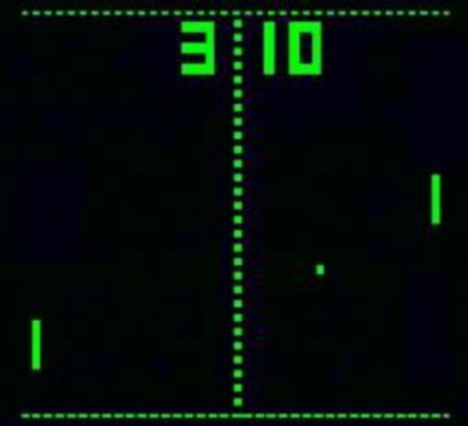
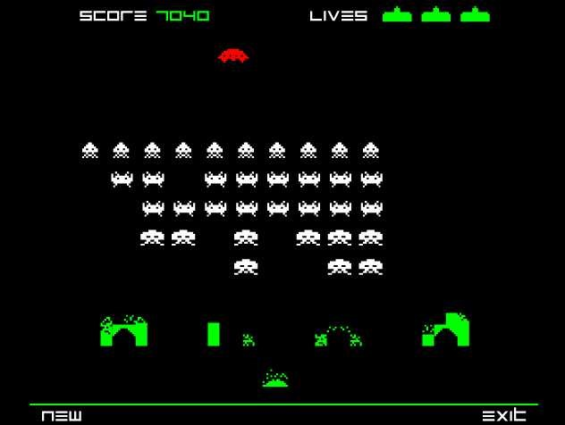
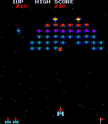
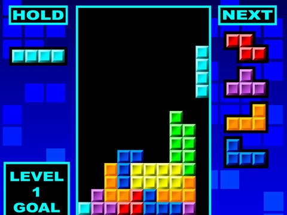
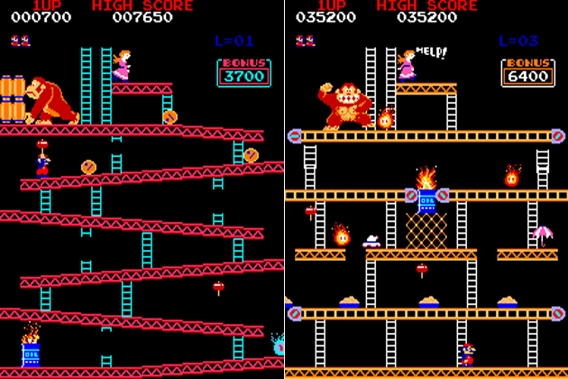
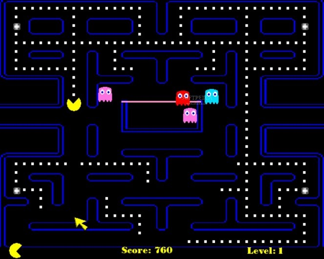
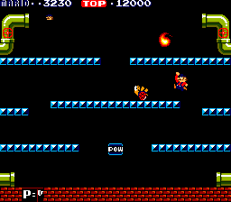
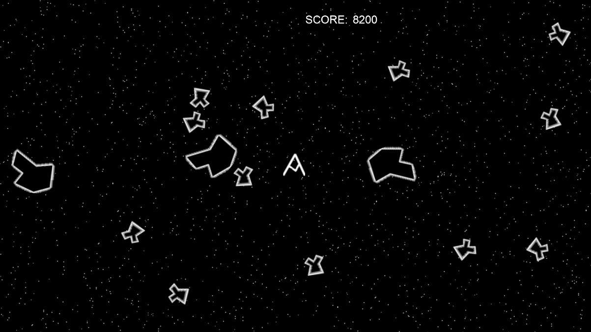

# Examples of Classic Arcade Games

## Pong

Pong is really simple game. Two paddles on each side of the playfield which can move both up and down. The goal is to bounce the ball to the other players side and past his paddle. If the ball can not be cought using the paddle and it hits the left or right side the opposite player gains a point. It's a two-player game unless you add an artificial player (computer).

>>> *Figure: [Pong](img/pong.jpg)*

## Space Invaders

Space Invaders is a game from the seventies. The planet is attacked by aliens and it is your job to blast each and every one of them out of the sky. For this, you have the ultimate weapon at your disposal: a gigantic space cannon. This cannon can be moved from left to right to blast the alien ships who are trying to land on the surface of the planet. As the game proceeds, the alien ships get quicker and harder to kill.

>>> *Figure: [Space Invaders](img/space_invaders.jpg)*

## Galaxian

Galaxian was the Japanese's contender for Space Invaders. Very popular in the late 1970's. In Galaxian you control your own spaceship while trying to defeat hords of alien ships. Blast away those cannons. While able to move left and right, you can also advance forward an put the heat on those damn aliens.

>>> *Figure: [Galaxian](img/galaxian.png)*

## Tetris

Everyone knows tetris and it holds little secrets for us. Predefined shapes from above and your task is to fill the void below. Stack away and try to create horizontal lines to score those big points and get rid of those blocks. Ofcourse it gets harder with time and the blocks keep falling faster as if they were defying gravity itself.

>>> *Figure: [Tetris](img/tetris.jpg)*

## Donkey Kong
Donkey Donk has "apenapped" the love of your life and it's your job to save her. Few will know but this was the first game where Mario (from the later Mario Bros.) made his first appearance. Your weapons include a red hot smashing hammer and quick movement. Kong's biggest weapon is his size and the ability to throw keggs of beer at you. While most levels were single screen, some did expand sideways or vertically.

>>> *Figure: [Donkey Kong](img/donkey_kong.png)*

## Pac-Man
It's an all you can eat buffet of dots. All you need to do is navigate your way through a maze to find and eat them. But be ware, the ghosts Blinky, Pinky, Inky and Clyde are on your trail. If they catch you it will cost you a life. Most levels however also include power-up dots which allow the pray to become the hunter - next on the menu: Blinky, Pinky, Inky and Clyde. Once you have eaten everything, your up for the next challenge.

>>> *Figure: [Pac-Man](img/pac_man.jpg)*

## Mario Bros.
The first original Mario Bros. dates from 1983. As the city of New York is being plagued by all kind of bizar creatures that crawl from the sewers, two brothers, Mario and Luige, are brave enough to face these adversaries. While the originel game enabled you to jump and run, many sequels added all kinds of abilities.

>>> *Figure: [Mario Bros.](img/mario_bros.gif)*

## Super Mario Bros.

In this sequel to Mario Bros. your beloved women needs rescuing (again). While a first player controls Mario, a second controls the brother Luige as they travel through the Mushroom Kingdoom in search for their princess. This version also add all sorts of abilities such as allowing Mario to shoot fireballs. Next to that the game also evolved from a stagnant to a side-scrolling game, giving new dimensions to both bros. 

>>> *Figure: [Super Mario Bros.](img/super_mario_bros.png)*

## Asteroids
Space is full of asteroids and alien spaceships. Guess who's in the middle of all that trouble. Blast away with those space cannons and destroy everything in your path. Another cool thing about this game is that the space wraps around itself; if your leave the display at the left side, you return at the right. Warp speed, Mr. Sulu.

>>> *Figure: [Asteroids](img/asteroids.jpg)*
