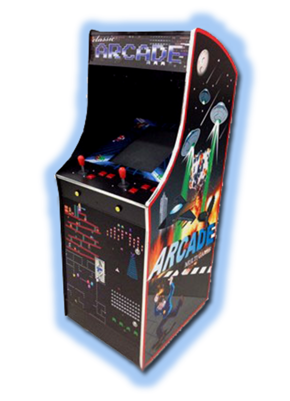

# Introduction

The main goal of this project is to design a classic arcade game.

A classic arcade game, as shown in the picture below, is essentially build using:

* a custom frame (case) to put all the hardware in
* user controls (push buttons, joysticks, ...)
* visualization (lights, display, ...)
* audio
* coin dispenser
* embedded system(s)

>>> *Figure: [Classic Arcade Game](img/classic_arcade_game.png)*

To speed up the hardware design, the case frame will be provided by us.

In this total design concept each student has to take responsibility in developing part of the design. While the electronics students are in charge of developing the hardware and firmware the IT students are in charge of the arcade game (software).

Naturally, all students in a lab group are responsible for planning, development, communication, reporting and the interfacing between the hardware and software part of the design.

A project can only be successfully achieved when all designers apply an analytical, methodical and systematic approach. A project consists of multiple deadlines. To meet these deadlines the team needs to communicate internally.

The chance for success increases when defining SMART objectives:

* Specific: clear and delimited
* Measurable: validation of the results (can be done in software by using automatic tests)
* Acceptable: does everyone accept the result (especially the clients, that would be us)
* Realistic: unachievable objectives are worthless
* Time-bound: make sure you meet the deadlines

A decent project management system is essential when working on a larger project with several team members. A pragmatic approach is the way to go. For this we provide a Redmine platform [project.labict.be](http://project.labict.be). By dividing all task in managable parts (issues in Redmine) each member of the group has an overview of the completed tasks and the tasks that still need to be fulfilled. By adding deadlines to each task the end result is a decent planning. At any moment each team member has an overview of the overall progress of the project.
