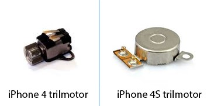
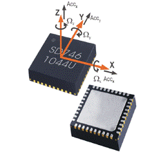
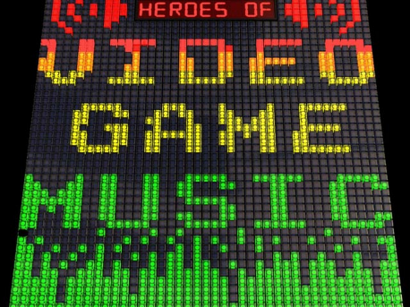

# Project Requirements

## Minimal Requirements

The project should at least adhere to the following requirements to be accepted by the client:

* Wireless communication channel between the handheld controller and the base station
* Base station should communicate with the game controller and be attached as joystick or keyboard device via USB
* The handheld controller should be energy-efficient
* The game should be controlled using the handheld controller
* The full setup has to be user-friendly, robust and reliable
* Attention should be spent at the design of the handheld controller; focus points are
	* ergonomics
	* aesthetics
	* final finish
* Version control using GIT and mBed versioning

## Restrictions

* The base station should be constructed using an mBed with application board equipped with an XBee module
* De game controller consists of a Raspberry Pi 2 running an operating system of own choice
* The handheld controller should be custom designed and contain the necessary expansion connectors
* Use object oriented programming languages for both the firmware as software

## Valuable expansions

The minimum design can be extended with:

* a vibration motor to give the user some feedback
* 3D awareness via an accelerometer and / or gyroscope in the handheld controller
* Audio support while playing
* Visual feedback of the gameplay to the handheld controller
* Configuration options for the handheld controller (using for example EEPROM)
* Top scores for the game
* Multiplayer options (multiple players using multiple controllers)
* Network based game (we can always provide another hardware kit)

>>> *Figure: [Vibration Motor](img/vibrate_motor.jpg)*

>>> *Figure: [Accelerometer](img/accelerometer.gif)*

>>> *Figure: [Video Game Audio](img/video_game_audio.png)*
