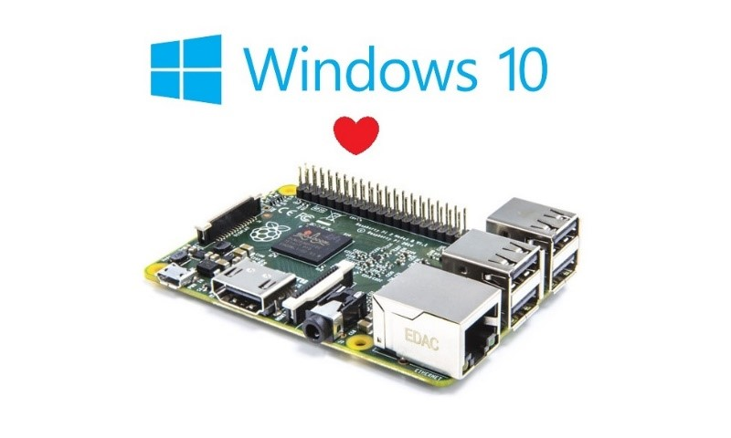

# Raspberry Pi 2

The Raspberry Pi is a single board computer based on an ARM-processor. It is manufactured and sold at a minimal price which makes it extremely popular and within reach of students.

The Raspberry Pi was developed at the University of Cambridge and focusses on educational purposes. The Raspberry Pi 2 model B (shown in the figure below), which replaces the original Raspberry Pi 1 model B+ since February 2015.

>>> *Figure: [Raspberry Pi 2](img/raspberry_pi_2.jpg)*

The Raspberry Pi 2 model B+ has following features:

* a 900 MHz quad-core ARM Cortex-A7 CPU
* 1 GB of RAM memory
* 4 USB ports
* 40 GPIO pins
* Full HDMI port
* Ethernet port
* Combined 3.5 mm audio jack & composite video
* Camera interface (CSI)
* Display interface (DSI)
* Micro SD card slot
* VideoCore IV 3D graphics core

The Raspberry Pi hardware platform is since the beginning supported by the Linux kernel. Several distributions are available for download at the official website [raspberrypi.org](https://www.raspberrypi.org/).

Since the launch of the Raspberry Pi 2 Microsoft also jumped on the wagon with their Windows 10 IOT version.

