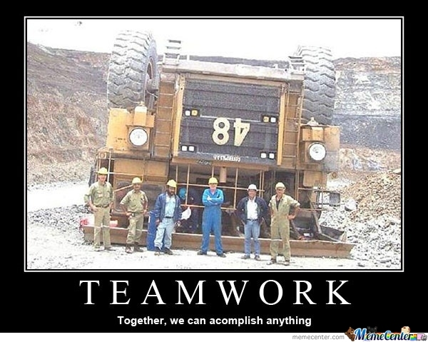

# Reporting

Reporting is done through the wiki on Redmine. It does have to adhere to a certain structure:

* index page with abstract and table of contents
* introduction
* actual content
* costings
* conclusions
* sources (where you got your information)
* attachments (images, schematics, code, ...) (can be uploaded in documents / files)

Redmine will be locked for each group 1 week after the final presentation; so Wednesday the 18th of May 2016. This means you will not be able change anything anymore after this date.

>>> *Figure: [Teamwork](img/teamwork.jpg)*
