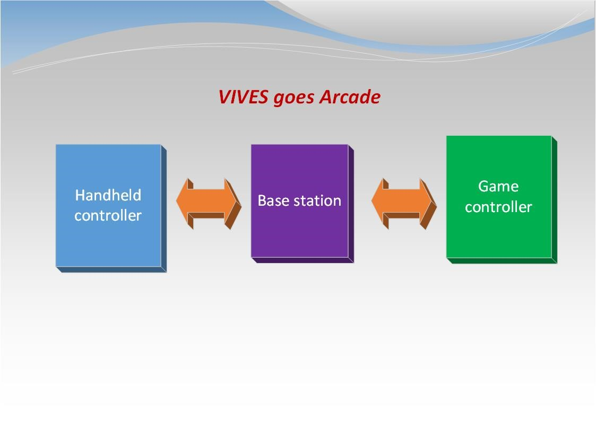
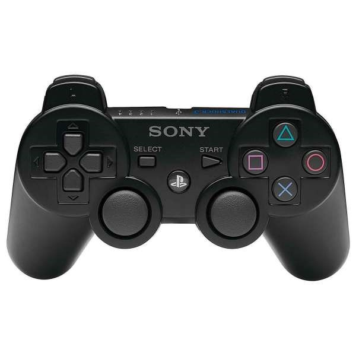

# Top Level Design

The goal of this project is to design a game for the arcade case provided to you. This game will have to run on a Raspberry 2 embedded system (further called the game controller). The game controller can be equiped with a Linux distribution or even a Windows 10 IOT.

Your implementation also needs to include a custom designed wireless handheld game controller (further called the handheld controller). This wireless controller will need to communicate with an mBed microcontroller board using a custom designed communication protocol over XBee.

The base station should then be able to forward the collected commands to the game controller, preferably configured as a joystick or keyboard device (see USB HID).

Basically the design can be split into three major components as shown in the image below:

* the handheld controller
* the base station
* the game controller

>>> *Figure: [Top Level Design Components](img/top_level_design.jpg)*

## The handheld controller

It's the responsibility of the electronics students to design the hardwar and firmware of the handheld controller. Ofcourse this does not mean that the IT student cannot give a hand or give some advice on for example the design strategy of the firmware.

The PCB should be custom designed and not based on an existing design or put together using breakout boards. The prototype however can be put together using applications and prototyping boards.

While a first prototype should be your first concern, you also need to work towards a finished product. Once the prototype is finished a final version is to be ordered with EuroCircuits. See Redmine milestones for a deadline date.

>>> *Figure: [Inside of Handheld Controller](img/handheld_controller_open.png)*

As a microcontroller you can use an mBed, however this is not mandatory. You are however obligated to use XBee for the wireless communication between the base station and the handheld controller.

Necessary characteristics of the handheld controller include:

* manual controls such as joysticks, push buttons, ...
* visual or audio feedback for the user
* 3D controls (using a gyroscope and/or accelerometer)
* battery powered
* energy efficient
* compact
* user friendly
* robust
* aesthetic and ergonomic design

The hardware needs to provided at least:

* 2 joystick controllers
* 4 push buttons
* XBee wireless communication with base station
* a battery management system
* a compact LCD
* a LED bar
* expansion connectors for a
	* buzzer
	* vibration motor

The quality of your handheld controller can be increased by adding optional hardware features such as:

* a 3D accelerometer
* a vibration motor
* audio feedback
* a configuration memory (EEPROM)
* a real time clock

The only limitation is your creativity (and time ofcourse). Feel free to add your own custom options.

>>> *Figure: [Handheld Controller](img/handheld_controller.jpg)*
