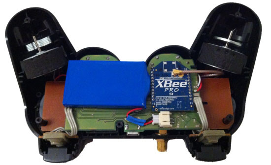
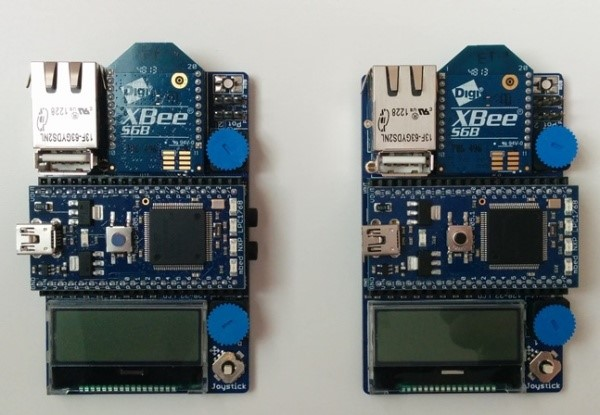

# Top Level Design

The goal of this project is to design a game for the arcade case provided to you. This game will have to run on a Raspberry 2 embedded system (further called the game controller). The game controller can be equipped with a Linux distribution or even a Windows 10 IOT.

Your implementation also needs to include a custom designed wireless handheld game controller (further called the handheld controller). This wireless controller will need to communicate with an mBed microcontroller board using a custom designed communication protocol over XBee.

The base station should then be able to forward the collected commands to the game controller, preferably configured as a joystick or keyboard device (see USB HID).

Basically the design can be split into three major components as shown in the image below:

* the handheld controller
* the base station
* the game controller

>>> *Figure: [Top Level Design Components](img/top_level_design.jpg)*

## The handheld controller

It's the responsibility of the electronics students to design the hardware and firmware of the handheld controller. Of course this does not mean that the IT students cannot give a hand or give some advice on the design strategy of the firmware.

The PCB should be custom designed and not based on an existing design or put together using breakout boards. The prototype however can be put together using applications and prototyping boards.

While a first prototype should be your first concern, you also need to work towards a finished product. Once the prototype is finished a final version is to be ordered with EuroCircuits. See Redmine milestones for a deadline date.

>>> *Figure: [Inside of Handheld Controller](img/handheld_controller_open.png)*

As a microcontroller you can use an mBed, however this is not mandatory. You are however obligated to use XBee for the wireless communication between the base station and the handheld controller.

Necessary characteristics of the handheld controller include:

* manual controls such as joysticks, push buttons, ...
* visual or audio feedback for the user
* 3D controls (using a gyroscope and/or accelerometer)
* battery powered
* energy efficient
* compact
* user friendly
* robust
* aesthetic and ergonomic design

The hardware needs to provide at least:

* 2 joystick controllers
* 4 push buttons
* XBee wireless communication with base station
* a battery management system
* a compact LCD
* a LED bar
* expansion connectors for a
	* buzzer
	* vibration motor

The quality of your handheld controller can be increased by adding optional hardware features such as:

* a 3D accelerometer
* a vibration motor
* audio feedback
* a configuration memory (EEPROM)
* a real time clock

The only limitation is your creativity (and time of course). Feel free to add your own custom options.

>>> *Figure: [Handheld Controller](img/handheld_controller.jpg)*

## Base station

It's the responsibility of the electronics students to design the hardware and firmware of the base station. Of course this does not mean that the IT students cannot give a hand or give some advice on the design strategy of the firmware.

To speed up the (hardware) design of the base station, an mBed with application board, as shown in the figure below, can be used.

More information on the mBed can be found at [mBed](http://mbed.org). Also check out [mBed application board](https://developer.mbed.org/cookbook/mbed-application-board).

>>> *Figure: [mBed Application Board with XBee module](img/mbed.jpg)*

Minimal functionality of the base station includes:

* wireless communication with the handheld controller
* communication with the game controller
* communication management (communication protocol for wireless channel)
* should connect to game controller as a keyboard or joystick (HID USB)

The base station is primarily responsible for the wireless communication with the handheld controller. Of course the information should be exchanged with the game controller.

A decent protocol will need to be engineered and implemented. All handheld controller use XBee as a communication channel configured in broadcast mode. This means your base station will also receive the XBee messages of the other team and addressing your devices will be an issue. As a practical example you can take a look at the structure of Ethernet frames and CAN frames, both of which are depicted below.

>>> *Figure: [Ethernet Frame](img/ethernet_frame.gif)*

>>> *Figure: [CAN Frame](img/can_frame.png)*

The communication protocol defines the structure of the frames and the data that is exchanged. Some common fields in a communication frame are:

* frame delimiters
* control / status information
* data field
* data length
* source address
* destination address
* error checksum (CRC for example)

The base station will also need to setup a bi-directional communication channel with the game controller (which executes the game software). By using USB, the base station can be setup as a keyboard or joystick (HID) making life a whole lot easier.

Again it is crucial that the group agrees on a design for the data exchange between the devices, documents it, and adheres to it. And all of this within the given deadlines.

## The Game Controller

It's the responsibility of the IT students to design the actual game.

For the game controller hardware a Raspberry Pi 2 has to be used. The user input has to come from the handheld controller via the base station connected as a USB device (keyboard or joystick).

The programming language and environment used to develop the game it totally up to your team. Choose wisely. Some possible choices include:

* JavaScript (yes a browser game is allowed)
* Python
* Ruby
* C++
* C#

To meet the given objectives the IT side of the project is to be developed in two phases:

* Phase 1 - Design of the game Pong
* Phase 2 - Design of a custom arcade game of your choosing

By splitting up the design of the game in two stages, very useful experience is gained regarding visualization, control, gameplay, the development of artificial intelligence, user interaction, ...

### Phase 1 - Pong

Pong is very simple game where a ball is bounced between two players on opposite sides of the playing field. The ball needs to be caught with a paddle the player controls. If missed a point is given to the other player.

A commercial implementation of this popular arcade game is shown in the figure below.

>>> *Figure: [Pong Arcade Game](img/pong_arcade_game.jpg)*

The successful realization of such a simple game requires some clear milestones and thoughtful planning regarding:

* visualization (ball, paddles, score, ...)
* user controls
* game behavior and rules
* user feedback

Also make sure to test this on the Raspberry Pi 2. You can use a development machine different from the Pi but frequent test with the embedded system should be conducted. Not all software that runs on a host machine will run on the Raspberry Pi or even compile for that matter.

### Phase 2 - Custom Arcade Game

In this stage of the design you should apply the lessons learned from the first stage and not make the same mistakes anymore.

When deciding which type of game to develop you should choose a game that everyone believes in. All group members should stand behind the choice. This leads to a higher success rate and will also motivate everyone to take it that extra step further.
